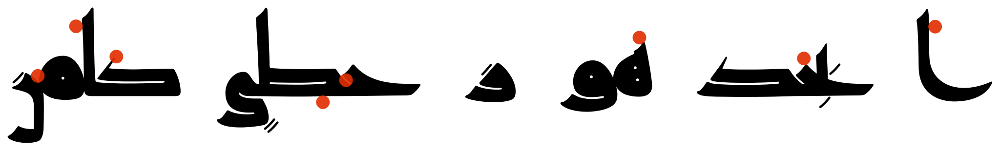

أميري
-----

{:.sample}

[اعرف أكثر...](https://www.amirifont.org){:.more}
[ويكيبيديا](https://ar.wikipedia.org/wiki/الخط_الأميري) |
[جت‌هب](https://github.com/aliftype/amiri) |
[خطوط جوجل](https://fonts.google.com/specimen/Amiri)
{:.links}

مدى
----

{:.sample}
* *{:.more}
[جت‌هب](https://github.com/aliftype/mada) |
[خطوط جوجل](https://fonts.google.com/specimen/Mada)
{:.links}

كوفي ريم
--------

{:.sample}
* *{:.more}
[جت‌هب](https://github.com/aliftype/reem-kufi) |
[خطوط جوجل](https://fonts.google.com/specimen/Reem+Kufi)
{:.links}

Aref Ruqaa
----------

{:.sample}
* *{:.more}
[جت‌هب](https://github.com/aliftype/aref-ruqaa) |
[خطوط جوجل](https://fonts.google.com/specimen/Aref+Ruqaa)
{:.links}

قاهري
-----

{:.sample}
[اعرف أكثر...](/qahiri){:.more}
[جت‌هب](https://github.com/aliftype/qahiri) |
[خطوط جوجل](https://fonts.google.com/specimen/Qahiri)
{:.links}

رَقّ
----

{:.sample}
[اعرف أكثر...](/raqq){:.more}
[جت‌هب](https://github.com/aliftype/raqq)
{:.links}

كوفي رنا
--------

{:.sample}
[اعرف أكثر...](/rana-kufi){:.more}
[جت‌هب](https://github.com/aliftype/rana-kufi)
⚠️🚧
{:.links}