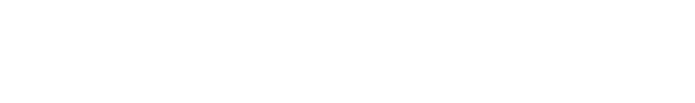
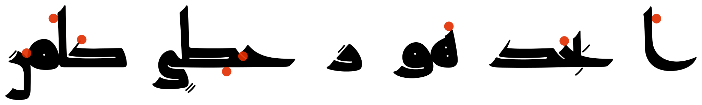
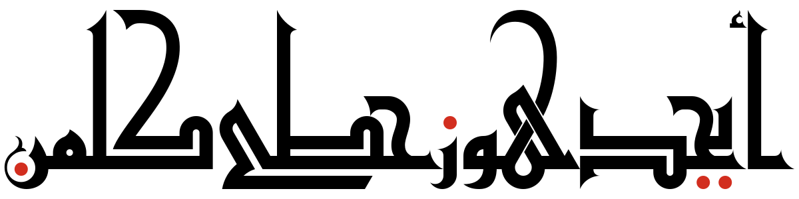

Amiri
-----

{:.sample}

[Read more...](https://www.amirifont.org){:.more}
[Wikipedia](https://en.wikipedia.org/wiki/Amiri_(typeface)) |
[Github](https://github.com/aliftype/amiri) |
[Google Fonts](https://fonts.google.com/specimen/Amiri)
{:.links}

Mada
----

{:.sample}
* *{:.more}
[Github](https://github.com/aliftype/mada) |
[Google Fonts](https://fonts.google.com/specimen/Mada)
{:.links}

Reem Kufi
---------

{:.sample}
* *{:.more}
[Github](https://github.com/aliftype/reem-kufi) |
[Google Fonts](https://fonts.google.com/specimen/Reem+Kufi)
{:.links}

Aref Ruqaa
----------

{:.sample}
* *{:.more}
[Github](https://github.com/aliftype/aref-ruqaa) |
[Google Fonts](https://fonts.google.com/specimen/Aref+Ruqaa)
{:.links}

Qahiri
------

{:.sample}
[Read more...](/qahiri){:.more}
[Github](https://github.com/aliftype/qahiri) |
[Google Fonts](https://fonts.google.com/specimen/Qahiri)
{:.links}

Raqq
----

{:.sample}
[Read more...](/raqq){:.more}
[Github](https://github.com/aliftype/raqq)
{:.links}

Rana Kufi ⚠️🚧
---------

{:.sample}
[Read more...](/rana-kufi){:.more}
[Github](https://github.com/aliftype/rana-kufi)
{:.links}

XITS Math
---------

{:.sample}
* *{:.more}
[Wikipedia](https://en.wikipedia.org/wiki/XITS_font_project) |
[Github](https://github.com/aliftype/xits)
{:.links}

<a rel="me" href="https://typo.social/@khaled" style="visibility: hidden;">Mastodon</a>
